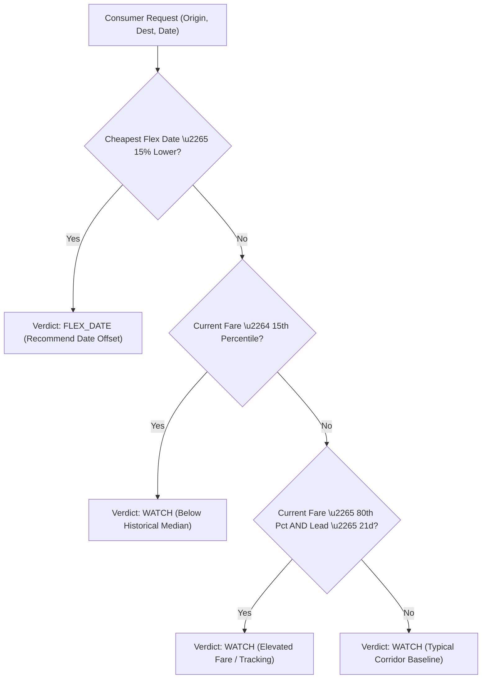

# AeroGuide Forecasting Methodology & Versioned Decision Policies

## 1. Empirical Readiness & Anti-Hallucination Policy

AeroGuide adheres to strict scientific integrity:

> **Rule 1**: No synthetic target generation.
> **Rule 2**: Machine learning model training remains **DISABLED** (`INSUFFICIENT_LONGITUDINAL_HISTORY`) until $\ge 7$ longitudinal observation days exist for candidate routes.
> **Rule 3**: Zero hallucinated probability percentages. When empirical requirements are unmet, the system explicitly reports status `COLLECTING_LONGITUDINAL_EVIDENCE`.

---

## 2. Versioned Decision Policy (`DECISION_POLICY_V1`)

While longitudinal time-series data accumulates, consumer guidance is driven by a deterministic, transparent, and auditable heuristic policy:

### Policy Parameters
- `book_percentile`: 15.0 (Lowest 15% of historical corridor observations)
- `wait_percentile`: 80.0 (Upper 20% of historical corridor observations)
- `wait_min_lead_days`: 21 days
- `flex_date_threshold_pct`: 15.0%
- `stable_threshold_pct`: 3.0%

### Decision Logic Tree

---

## 3. The 8-Stage Verifiable Decision Trace

Every recommendation generated by AeroGuide is backed by an immutable 8-node computational trace:

1. **User Context & Standardized Request**: Validates standard passenger contract (1 Adult, Economy, INR, One-Way).
2. **Source Selection & Telemetry Audit**: Audits data provenance and source health.
3. **Route Universe & Corridor Filtering**: Resolves 4-tier route classification and DGCA basket status.
4. **Historical Price Distribution Baseline**: Computes corridor empirical minimum, median, maximum, and percentiles.
5. **Multi-Carrier Alternative Comparison**: Aggregates quotes across all scheduled carriers for the requested date.
6. **Flexible Date Optimization Window**: Evaluates fare spreads across adjacent travel dates ($\pm k$ days).
7. **Longitudinal Evidence & Model Safety Check**: Verifies dataset sufficiency and prevents premature ML execution.
8. **Deterministic Policy Verdict**: Applies versioned policy rules (`DECISION_POLICY_V1`) and generates SHA-256 trace signature.

---

## 4. Evaluation Strategy for Future ML Model

When longitudinal target pairs are complete:
- **Validation**: Walk-Forward Rolling Origin Time Split (Train: Days $1\dots T$, Test: Days $T+1\dots T+k$).
- **Benchmark Baselines**:
  1. Historical Median Direction Baseline
  2. Advance-Purchase Window Slope Baseline
- **Minimum Release Gate**: Outperforming random guess and median baseline by $\ge 8\%$ balanced accuracy across all 10 core routes.
