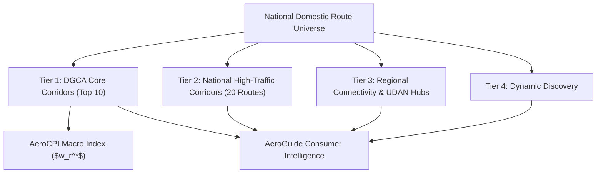

# National Route Universe & Coverage Architecture

## 1. Multi-Tier Corridor Hierarchy

AeroCPI and AeroGuide operate on a tiered route topology designed to expand consumer market intelligence while preserving the statistical purity of the DGCA Consumer Price Index basket.

---

## 2. Tier Breakdown

### Tier 1: DGCA Core Corridors (AeroCPI Sovereign Basket)
- **Basket Membership**: `is_cpi_basket_member = True`
- **Corridors (10)**:
  1. `DEL-BOM` & `BOM-DEL` (Delhi - Mumbai)
  2. `DEL-BLR` & `BLR-DEL` (Delhi - Bengaluru)
  3. `DEL-MAA` & `MAA-DEL` (Delhi - Chennai)
  4. `BOM-BLR` & `BLR-BOM` (Mumbai - Bengaluru)
  5. `DEL-CCU` & `CCU-DEL` (Delhi - Kolkata)
- **Weight Source**: Official DGCA City-Pair Passenger Volume Statistics.
- **Statistical Invariance**: Only Tier 1 routes enter the Jevons elementary aggregation and weighted geometric national index ($I_h$).

### Tier 2: National High-Traffic Corridors (AeroGuide Market Coverage)
- **Basket Membership**: `is_cpi_basket_member = False`
- **Corridors (20)**:
  - `DEL-HYD`, `HYD-DEL` (Delhi - Hyderabad)
  - `BOM-GOI`, `GOI-BOM` (Mumbai - Goa)
  - `BLR-HYD`, `HYD-BLR` (Bengaluru - Hyderabad)
  - `BOM-MAA`, `MAA-BOM` (Mumbai - Chennai)
  - `DEL-PNQ`, `PNQ-DEL` (Delhi - Pune)
  - `BLR-MAA`, `MAA-BLR` (Bengaluru - Chennai)
  - `DEL-COK`, `COK-DEL` (Delhi - Kochi)
  - `BOM-HYD`, `HYD-BOM` (Mumbai - Hyderabad)
  - `DEL-AMD`, `AMD-DEL` (Delhi - Ahmedabad)
  - `BLR-CCU`, `CCU-BLR` (Bengaluru - Kolkata)
- **Purpose**: Broad consumer airfare search, carrier price spread comparisons, and flexible date recommendations.

### Tier 3: Regional Connectivity (UDAN & State Capitals)
- Connects regional tier-2/tier-3 cities (e.g., `DEL-IXC`, `DEL-GAU`, `DEL-PAT`, `DEL-JAI`, `DEL-LKO`).

### Tier 4: Dynamic Discovery
- Dynamically logged routes discovered during exploratory consumer searches.

---

## 3. Strict Boundary Isolation Principle

1. **AeroCPI**: Measures the macroeconomic price movement of Indian domestic air travel using frozen DGCA weights ($w_r^*$). Adding routes to Tiers 2–4 has **zero effect** on AeroCPI index numbers or formula attribution.
2. **AeroGuide**: Evaluates specific consumer airfare choices across all 4 tiers, providing price position context, airline alternatives, and verifiable decision traces.
